

  

---

<h1>🏃 몽땅내땅 🏃</h1>

<h3> “팀원들과 함께 걷고 뛰며 땅따먹기, 협력과 경쟁이 가미된 새로운 모험을 즐겨보세요!” </h3>

<h3> 몽땅내땅은 사용자 위치 기반 야외 활동 장려 어플리케이션입니다! </h3>

<h2>Members</h2>

|                 Name                 |                   Role                   | Detail |
|:------------------------------------:|:----------------------------------------:|:------:|
|    [안재현](https://github.com/ddd)     |      Team leader, Backend Developer      |      |
|    [박세건](https://github.com/PARKSEGUN)     |            Backend Developer            |        |
|    [서진경](https://github.com/JinKyeong-Seo)     |            Backend Developer             |        |
| [이강산](https://github.com/clintkslee) |            Backend Developer             |        |
|    [이예원](https://github.com/Eyekrw)     | Frontend Developer, Cloud/Infra Engineer |        |
|    [탁호준](https://github.com/hohocoding97)     |            Frontend Developer            |        |

---

<h2>Tech stack</h2>

<h3> Frontend </h3>

  
  
  

<h3> Backend </h3>

  
  
  
  

<h3> Database </h3>

  
  
  

<h3> Infra & DevOps </h3>

  
  
  
  

---

<h2>Architecture</h2>

  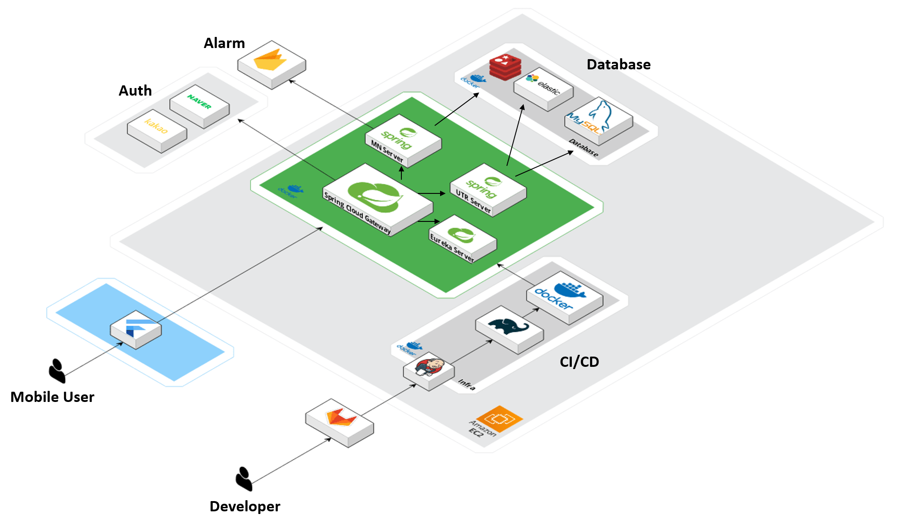

---

<h2>ER Diagram</h2>

  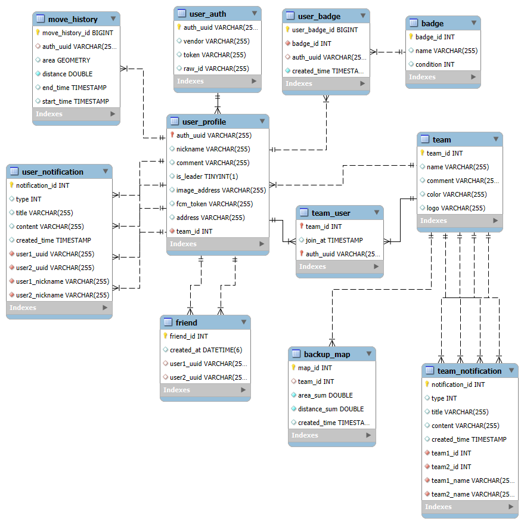

---

<h2>UCC / Demo Video</h2>

  

    
<strong>UCC</strong>

    
  

  

    
<strong>Demo Video</strong>

    
  

---

<h2>UI / UX</h2>

<table style="width: 100%; border-collapse: collapse;">
  <tr>
    <td style="width: 25%;">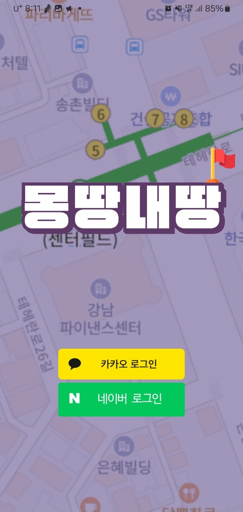</td>
    <td style="width: 25%;">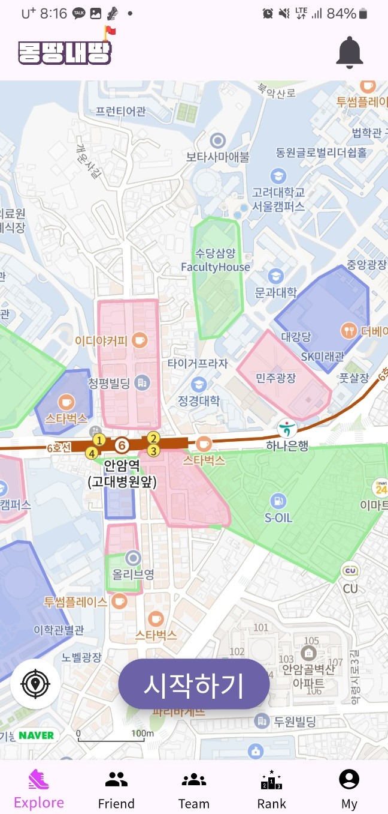</td>
    <td style="width: 25%;">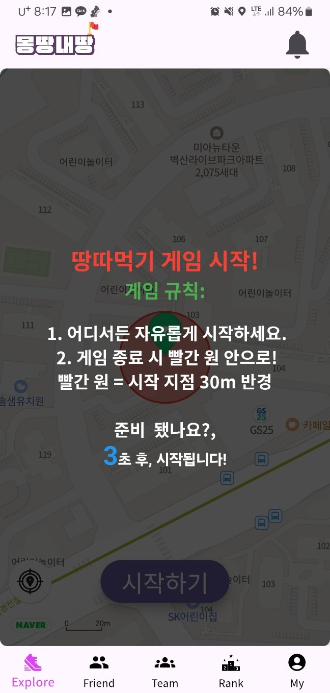</td>
    <td style="width: 25%;">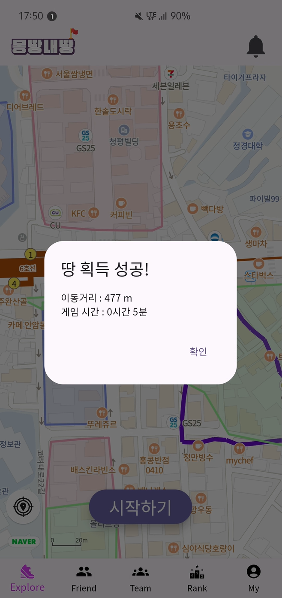</td>
  </tr>
  <tr>
    <td style="width: 25%;">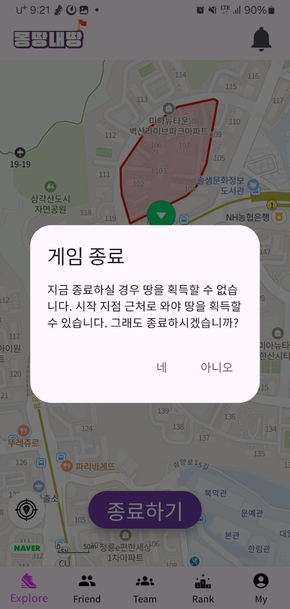</td>
    <td style="width: 25%;">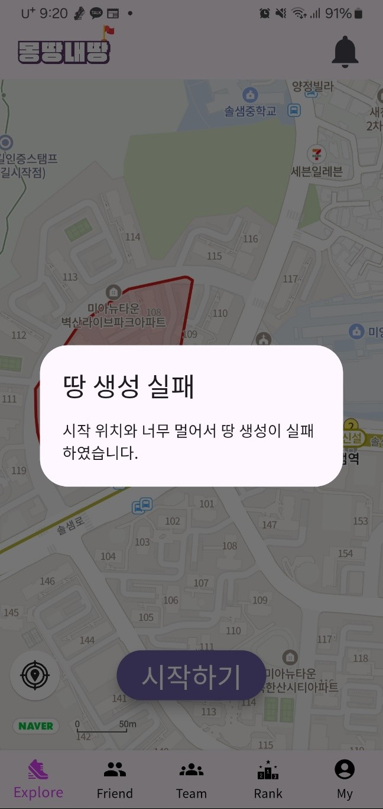</td>
    <td style="width: 25%;">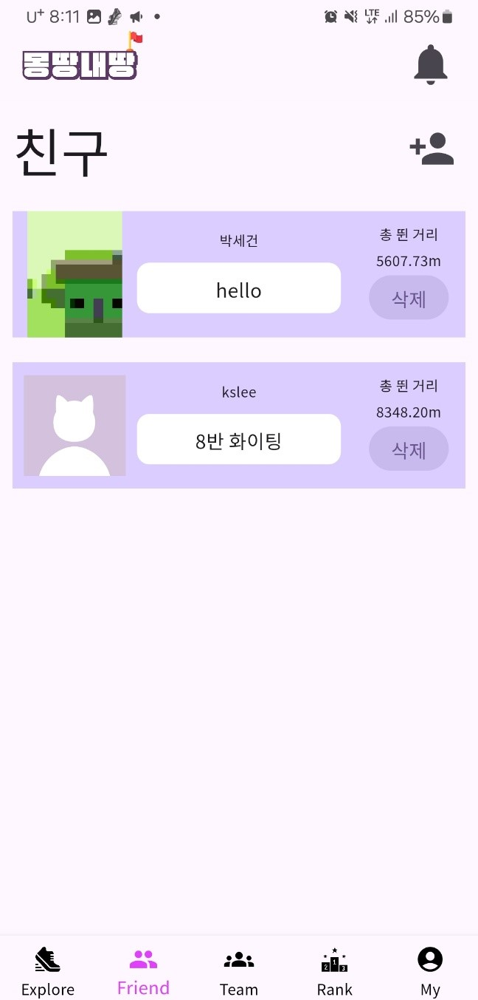</td>
    <td style="width: 25%;">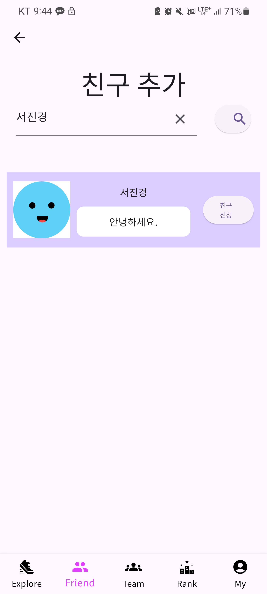</td>
  </tr>
  <tr>
    <td style="width: 25%;">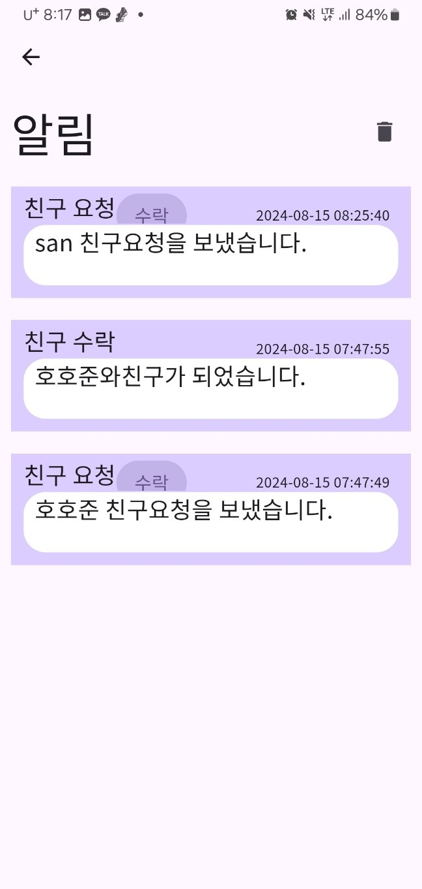</td>
    <td style="width: 25%;">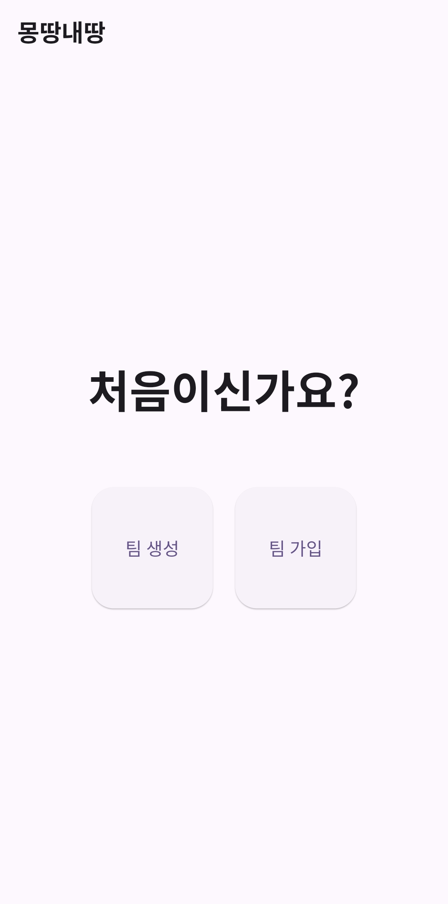</td>
    <td style="width: 25%;">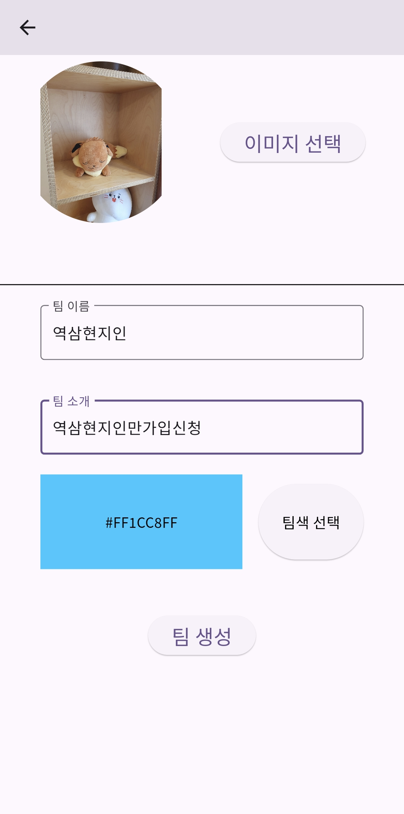</td>
    <td style="width: 25%;">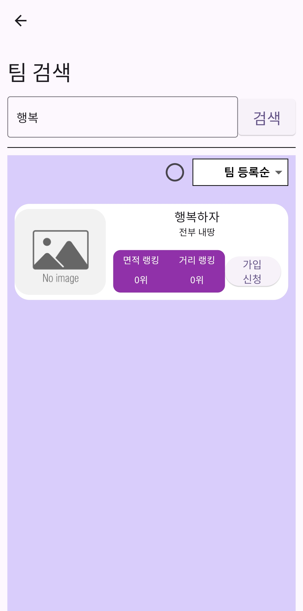</td>
  </tr>
  <tr>
    <td style="width: 25%;">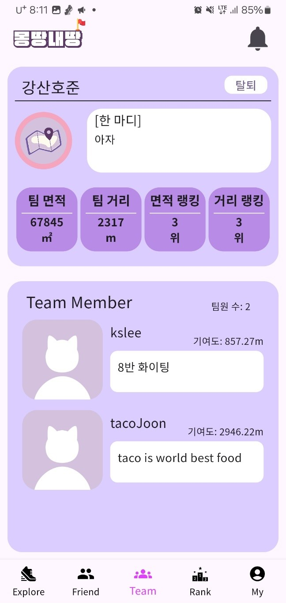</td>
    <td style="width: 25%;"></td>
    <td style="width: 25%;">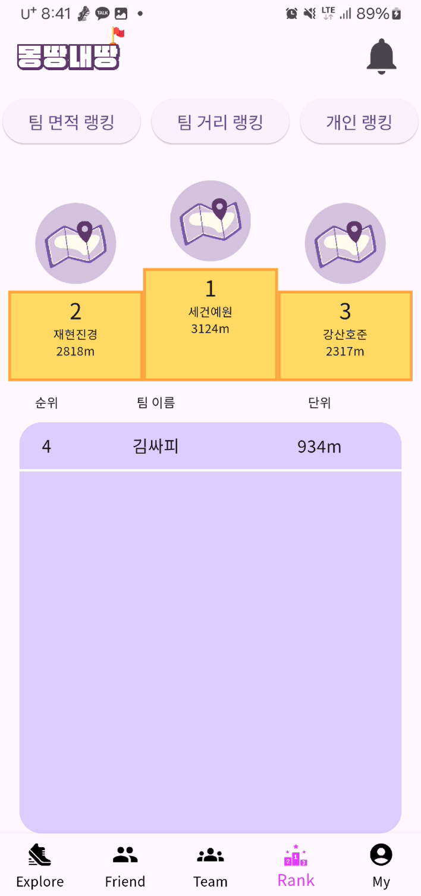</td>
    <td style="width: 25%;">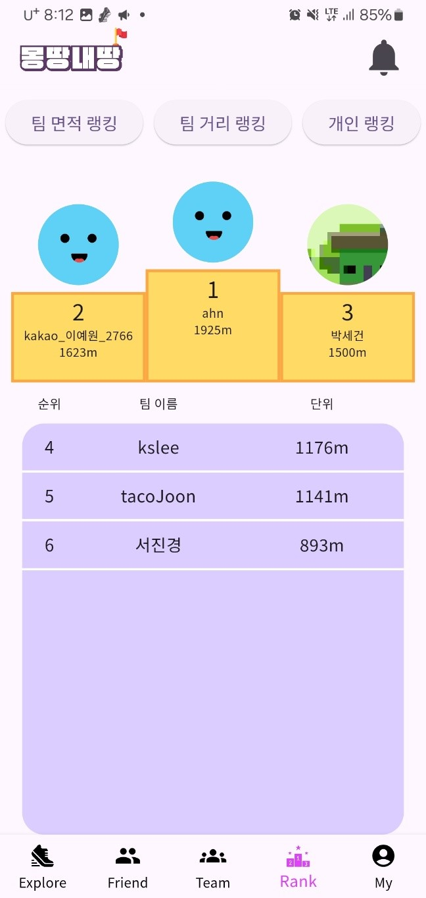</td>
  </tr>
  <tr>
    <td style="width: 25%;"></td>
    <td style="width: 25%;"></td>
    <td style="width: 25%;"></td>
    <td style="width: 25%;"></td>
  </tr>
</table>

---

